|*Les petits tutoriels du CorLab* | 
|------|
| Ballades virtuelles avec contenu dynamique|
|Date: **Avril 2024** |
|Version: **1** |
|Auteur principal: **Maxime Renauld**, élève en TPRO SN RISC au lycée Louis de Cormontaigne, Metz | 
|Programmation javascipt: **Yanis Maafa**, élève en TPRO SN SSIHT au lycée Louis de Cormontaigne, Metz |
|Validation/Direction: **Matthieu Farcot** |
|Relecture: **Solene Mvutu Mbeya**, élève en TPRO SN RISC au lycée Louis de Cormontaigne, Metz |
|Document réalisé dans le cadre d'un stage de Terminale Professionnelle Bac PRO Systèmes Numériques, option RISC |
| Ressources iconographiques: **Photos et captures d'écrans (c) M. Renauld, Lycée Louis de Cormontaigne, Metz** |
| Document sous licence **CC-BY-4.0** |

# Création de visites virtuelles et contenus pédagogiques en VR libres et gratuits


## Objectif du document
Ce document a pour objectif d'expliquer comment créer et mettre en ligne des visites virtuelles incluant des éléments pédagogiques diversifiés. La technologie utilisée sera entièrement gratuite et sous licence libre - y inclut l'hébergement. Cette technologie doit permettre une navigation compatible avec les spécificités de multiples appareils, y inclut la navigation en VR.

Ce document inclut toutes les étapes de la réalisation, des prises de vue à l'édition du code en passant par l'hébergement. Le tout a pour objectif d'être écrit de la manière la plus simple et didactique possible, en procédant étape par étape.

La cible du document est le grand public *sans connaissances techniques préalables*.


## Introduction

La réalité virtuelle a le potentiel de transformer l’éducation, en offrant des expériences d’apprentissage immersives et interactives. Les panoramas 360°, en particulier, peuvent permettre aux lycéens et étudiants de découvrir de nouveaux environnements et concepts d’une manière visuellement riche et engageante.

A-Frame, une bibliothèque JavaScript pour la création d’expériences de réalité virtuelle, rend cette technologie accessible à tous, même à ceux qui n’ont pas de connaissances approfondies en programmation. Avec A-Frame, vous pouvez consulter des panoramas 360° interactifs et immersifs directement dans votre navigateur web, ce qui est idéal pour une utilisation en classe ou à distance.

Sur cette page, nous vous guiderons à travers les étapes de la création de votre propre panorama 360° en utilisant A-Frame, spécifiquement adapté à un contexte éducatif. Nous commencerons par les bases, comme la configuration de votre environnement de développement et la prise de photos panoramiques, puis nous vous montrerons comment utiliser A-Frame pour assembler ces photos en une expérience de réalité virtuelle interactive.

Que vous soyez un enseignant cherchant à intégrer la réalité virtuelle dans votre salle de classe, un développeur web cherchant à créer des ressources éducatives interactives, ou simplement quelqu’un qui est curieux de la technologie de panorama 360°, nous espérons que vous trouverez cette page informative et utile. Bonne création !


# [Partie 1 - Matériel préparatoire et prises de vues](https://maximer37.github.io/VR-Markdown/guide1/partie1/index.html)


## En amont : La planification

La planification, définissant l'objet de la visite et le contenu qui devra s'afficher, est essentielle en amont de toute production. Ceci est plus simple à dire qu'à faire, mais il est essentiel de définir l'objectif de la visite et d'avoir une idée claire de *ce qui doit être montré*.

Dans notre cadre, nous allons réaliser une viste virtuelle simple du terrain de sport de lycée Louis de Cormontaigne à Metz, se basant sur deux panoramas à 360°. Cette visite devra inclure des informations textuelles, des images, des vidéos, et des objets en 3 dimensions qui s'insèrent naturellement dans un panorama en 360°. Pour simplifier l'exemple, nous allons lier deux panoramas 360° entre eux pour permettre de simuler une ballade. Suivant la logique de navigation entre panoramas, l'orientation de l'utilisateur dans un panorama va avoir un impact: il est plus naturel quand on se déplace d'un point A à un point B que la vue lors de l'arrivée au point B suive une ligne droite issue du point A, afin de faire comprendre l'idée du mouvement. De même, l'ensemble des panoramas seront enrichis avec du contenu pédagogique sous diverses formes. Ce contenu doit s'afficher *à sa place* dans le panorama (par exemple le texte qui donne des informations sur un bâtiment doit flotter uniquement au-dessus de ce batiment).

Ceci explique l'importance d'une réflexion en amont, afin d'être sûr d'avoir toutes les images requises. Prendre une prise de vue manquante dans un deuxième temps risque expose l'opération à des changements brutaux de conditions de navigation (lumière ou météo différente par exemple) qui vont nuire à l'immersion.

Attention en particulier aux épineuses questions de droits à l'image et des conséquences potentielles au niveau du RGPD. Il peut être utile de demander aux personnes ne souhaitant pas être visibles sur le panorama de sortir du champ de la caméra.

## Matériel nécessaire

- Une caméra 360° (nous utiliserons une caméra Insta 360 pour cet exemple). 
- Un pied pour appareil photo (afin d'avoir une hauteur de prise de vue fixe entre les différents panoramas)
- Un ordinateur, avec les logiciels suivants
  - Un environnement de développement (ici [VSCodium](https://vscodium.com)
  - Un logiciel d'édition et de retouche d'image (ici [GIMP](https://gimp.org)
  - Un compte GitHub (nous utiliserons cette plateforme pour l'hébergement des scènes, et nous nous assurerons que vous puissiez retrouver les fichiers issus de ce document)


### Prise des vues 360°

Il est utile de bien plannifier en amont de toutes prises de vues les endroits où seront réalisés les photos.
En extérieur, des outils comme Google Earth sont particulièrement utiles.


L'importation des images est le moment idéal pour modifier la résolution en 2880 pixels par 1440 pixels avec le logiciel de la caméra. Pour flouter les visages (question de droits à l'image), nous allons utiliser GIMP.

## GIMP - un couteau suisse de l'image pour préparer les panoramas

GIMP est accessible gratuitement, ce qui en fait un outil économique pour les artistes et les créateurs. GIMP offre une gamme complète d'outils de retouche d'images, y compris des outils de peinture, de sélection, de correction des couleurs, de clonage, de transformation et bien d'autres encore. Cette diversité d'outils permet aux utilisateurs de réaliser une grande variété de tâches de retouche et de manipulation d'images, y compris la création de panoramas 360°.

### Importation des images

Importez toutes les images composant vos panoramas 360° dans GIMP au format JPEG et aux dimensions 2880 x 1440 pixels.

### Réglages et corrections

Effectuez des ajustements de couleur, de contraste et de netteté pour harmoniser les différents panoramas 360°. Vous pouvez également utiliser des outils de retouche pour éliminer les imperfections ou les éléments indésirables de certaines image.

### Exportation de panoramas

Une fois que votre panorama 360° est retouché, exportez-le dans le format JPEG, avec une qualité moyenne. Assurez-vous de choisir un format d'image compatible avec les plateformes ou les appareils sur lesquels vous prévoyez de partager votre panorama.
## Création d’un compte GitHub

Pour commencer à utiliser GitHub, vous devez créer un compte personnel gratuit sur GitHub.com.

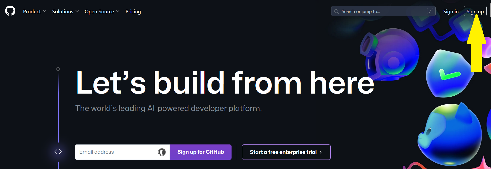

Suivez les indications pour créer votre compte personnel Assurez-vous d’utiliser un mot de passe fort et unique.

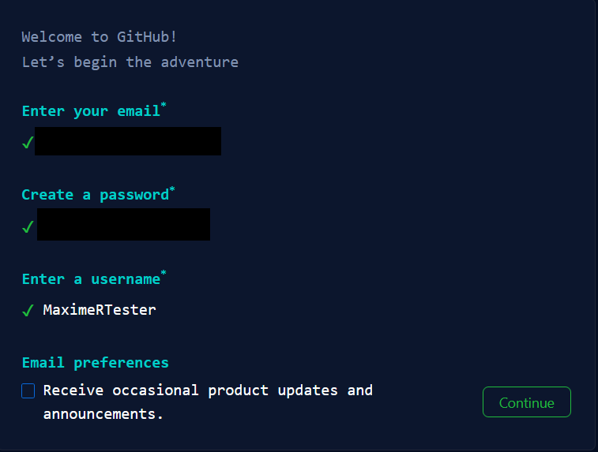

Vérifiez votre adresse e-mail lors de l’inscription. Sans adresse e-mail vérifiée, certaines tâches de base sur GitHub, comme la création d’un référentiel, ne seront pas possibles.


### Création d’un dépôt pour votre site


Vous pouvez créer un nouveau dépôt ou utiliser un dépôt existant pour votre site.

on va créer un ***repository***

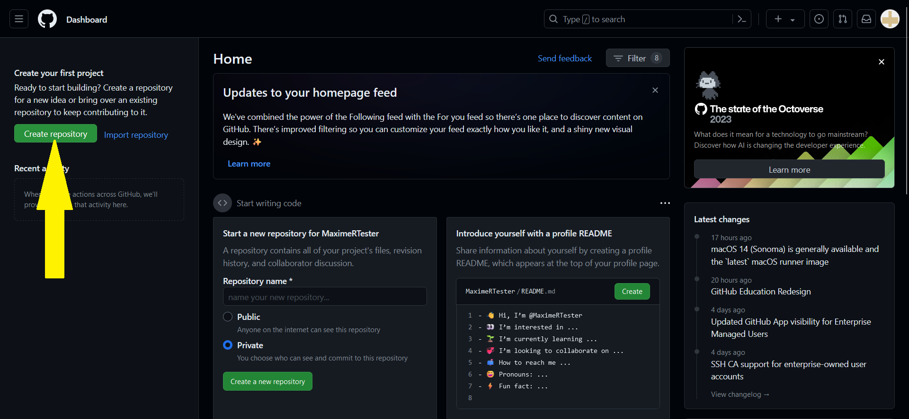


Choisissez un nom pour votre référentiel.

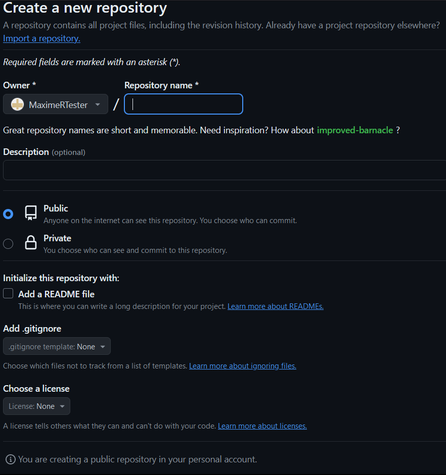

Sélectionnez “Public” comme visibilité du dépôt.
Cochez l’option “Initialize this repository with a README” (Initialiser ce dépôt à l’aide d’un fichier LISEZMOI).


Cliquez sur “Créer le dépôt”  en bas de la page.


### Création de votre site


Accédez au dépôt de votre site sur GitHub.

pour cela allez dans ***settings***


puis dans la rubrique ***page*** 


enfin selectionner ***select branch*** puis ***Main***


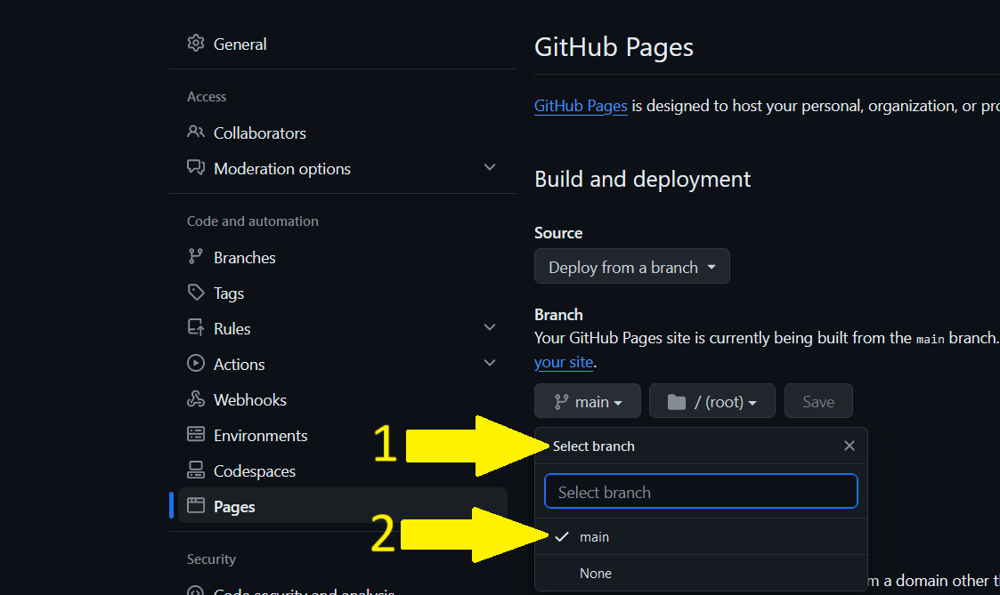


Configurez une source de publication pour votre site. Vous pouvez choisir entre différentes options, comme une branche dédiée ou un workflow GitHub Actions personnalisées.


Créez le fichier d’entrée pour votre site (par exemple, un fichier HTML, Markdown, etc.).


Publiez votre site en poussant vos fichiers vers le dépôt sur GitHub.


Votre site sera accessible via l’URL https://<votre-nom-d'utilisateur>.github.io.


Remarque : les sites GitHub Pages sont disponibles publiquement sur Internet, même si leur dépôt est privé. Assurez-vous de ne pas inclure de données sensibles dans votre dépôt avant la publication

### Création de la page HTML pour le panorama

Nous allons utiliser le code suivant pour importer l'image 360° sur le navigateur:

```html
<!DOCTYPE html>
<html>
  <head>
    <script src="https://aframe.io/releases/1.5.0/aframe.min.js"></script>
  </head>
  <body>
    <a-scene>
      <a-sky src="./images/panorama1.jpg"></a-sky>
    </a-scene>
  </body>
</html>
```
*... et c'est tout!*

Nous enregistrons ce document HTML à la racine de notre compte Github et l'intitulons index.html.

## Explication du code


Ce code est un exemple simple d’une page Web qui utilise la bibliothèque JavaScript A-Frame pour afficher une image à 360 degrés. Voici une explication détaillée de chaque partie :

`<!DOCTYPE html>` : Cette déclaration doit être la première ligne du document. Elle informe le navigateur que le document est une page HTML.

`<html>` : C’est la racine de la page HTML.

`<head>` : Cette balise contient des métadonnées sur le document HTML, qui ne sont pas affichées sur la page Web elle-même. Ici, elle contient une balise <script>.

`<script src="https://aframe.io/releases/1.5.0/aframe.min.js"></script>` : Cette balise importe la bibliothèque A-Frame, qui est une bibliothèque JavaScript pour la création d’expériences de réalité virtuelle.

`<body>` : Cette balise contient le contenu principal de la page Web, qui est affiché dans le navigateur.

`<a-scene>` : C’est une balise spécifique à A-Frame qui crée une scène 3D où vous pouvez placer des objets.

`<a-sky src="./images/3601.jpg"></a-sky>` : Cette balise spécifique à A-Frame crée un ciel autour de la scène avec comme texture l’image spécifiée. Dans ce cas, l’image est "3601.jpg" qui se trouve dans le répertoire "images".


`<a-scene>` est l’élément principal qui contient tous les objets 3D de la scène A-Frame.


`<a-assets>` est utilisé pour précharger les ressources, comme l'image de panorama.


`` définit une image que vous utiliserez pour le panorama. Remplace "chemin_vers_votre_image.jpg" par le chemin vers ton image de panorama.

`<a-sky src="#panorama-image"></a-sky>` crée le panorama en utilisant l’image que vous avez définie. Il utilise l’ID de l’image comme source.

N’oubliez pas de remplacer "chemin_vers_votre_image.jpg" par le chemin réel vers votre image de panorama. 


En résumé, ce code crée une scène de réalité virtuelle avec un ciel texturé par une image à 360 degrés. Vous pouvez interagir avec cette scène en utilisant la souris pour regarder autour de vous.

<!-- <a href="https://maximer37.github.io/VR-Markdown/"> -->


# [Partie 2 - Navigation entre deux panoramas 360°](https://maximer37.github.io/VR-Markdown/guide1/partie2/index.html)


Tout d’abord, nous avons intégré un modèle (template) dans le code, ce qui permettra d’économiser du temps lors de la création de fonctions. Ce modèle inclut en particulier deux fonctions essentielles:
- un effet d'aspiration lorsque le panorama est changé (impact visuel)
- une orientation logique lors de l'arrivée sur le nouveau panorama, afin de simuler un déplacement (impact fonctionnel)

Nous créons aussi une page JavaScript nommée `index.js`, qui nous permettra d’utiliser des variables et des fonctions spécifiques à JavaScript. De plus, nous avons conçu deux pages HTML qui sont rangées dans un dossier spécifique de l’arborescence : `./partie2/Pages-Index/default.html` et `./partie2/Pages-Index/1.html.` Dans ces fichiers index, vous trouverez du code pour insérer un objet, à savoir notre flèche, qui permettra de naviguer d’un panorama à l’autre.


## Un outil important: l'inspecteur A-Frame Framework :


### Planification et Conception : 

Avant de commencer la création du panorama 360°, définissez clairement votre vision et vos objectifs. Utilisez l'inspecteur pour esquisser et visualiser la disposition des éléments de la scène.

### Construction de la Scène :

Utilisez l'inspecteur pour ajouter et positionner les éléments de la scène, tels que les images panoramiques, les points d'intérêt et les zones interactives, en vous assurant que chaque élément contribue à l'immersion globale.

### Ajustements et Tests : 

Utilisez l'inspecteur pour ajuster les propriétés de la caméra et des éléments de la scène, en vous basant sur les retours visuels et les tests de navigation pour peaufiner chaque détail et optimiser l'expérience utilisateur.


### Débogage et Optimisation : 

Utilisez les outils de débogage de l'inspecteur pour identifier et corriger les éventuels problèmes de performance ou d'affichage, en veillant à ce que le panorama 360° fonctionne de manière fluide sur tous les appareils et navigateurs compatibles.

***En suivant ces étapes et en exploitant les fonctionnalités avancées de l'Inspecteur A-Frame Framework 1.5, vous serez en mesure de créer des panoramas 360° immersifs et captivants qui captiveront et engageront votre public cible.***


## Changer la couleur d'un object

Pour démarrer, il est nécessaire d'activer l'inspecteur en utilisant la combinaison de touches dans votre navigateur web  `ctrl` + `Alt` + `I` .


Sur votre gauche se trouvent les éléments constituant la page (le panorama, la caméra...).

Nous allons choisir l'élément ***MainScene*** à gauche, puis dans la liste déroulante, nous sélectionnerons l'entité ***fleche***.


Maintenant que notre flèche est sélectionnée, nous pouvons accéder au menu permettant de modifier ses différents éléments. Ce qui nous intéresse ici, c'est la couleur.

À droite, un menu s'est ouvert pour modifier la flèche. Nous allons sélectionner le menu déroulant ***Add composant*** et chercher ***Material***.


Ensuite, nous pouvons cliquer sur ***Material***, où une ligne indiquant couleur nous permettra de modifier la  ***color***. En cliquant sur le carré blanc, nous pourrons sélectionner la couleur souhaitée à l'aide du curseur.


Finalement, nous pouvons copier et extraire les modifications afin de les transformer en code à implémenter. 


Nous cherchons la ligne de code qui fait référence à la ***fleche*** , puis nous pouvons coller le nouveau code. 


# [Partie 3 - Animer un objet et insérer un texte](https://maximer37.github.io/VR-Markdown/guide1/partie3/index.html)

Ensuite, nous allons animer notre flèche pour qu'elle se déplace de haut en bas, afin de mieux indiquer la direction que prendra l'utilisateur, ainsi que l'ajout d'un disque.


## Utilisation de Blender  :


### Avantages de Blender :


[Blender](https://blender.org) est un logiciel gratuit et open source, qui offre une suite complète d'outils de modélisation 3D, permettant aux utilisateurs de créer des environnements virtuels complexes pour leurs panoramas 360°. Ces outils incluent la modélisation polygonale, la sculpture, le texturage, l'éclairage et le rendu avancé.

### Modélisation :

Utilisez les outils de modélisation de Blender pour créer l'environnement virtuel dans lequel votre panorama 360° sera situé.

### Texturage et éclairage : 

Appliquez des textures aux objets de votre scène et configurez l'éclairage pour créer l'ambiance souhaitée.

## Crée un objet sur Blender :

Tout d'abord, nous lançons le logiciel Blender et nous créons un cylindre. Pour cela, nous accédons au menu ***Modelisation***, puis à ***ajouter***, où nous sélectionnons ***Maillage*** et ensuite ***Cylindre***.

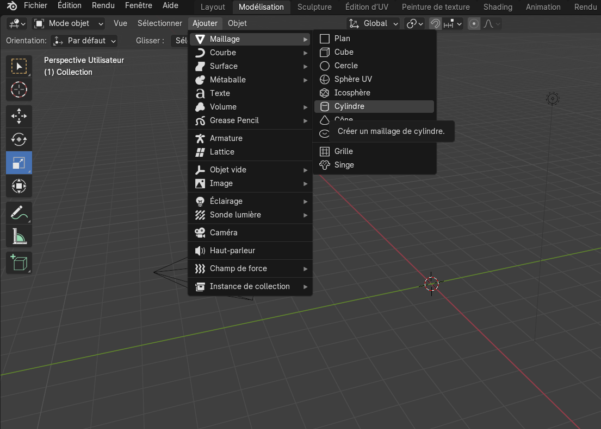

En conclusion, il ne reste plus qu'à redimensionner l'objet en utilisant le ***carre bleu***, qui nous permettra de modifier l'objet sur l'axe vertical.

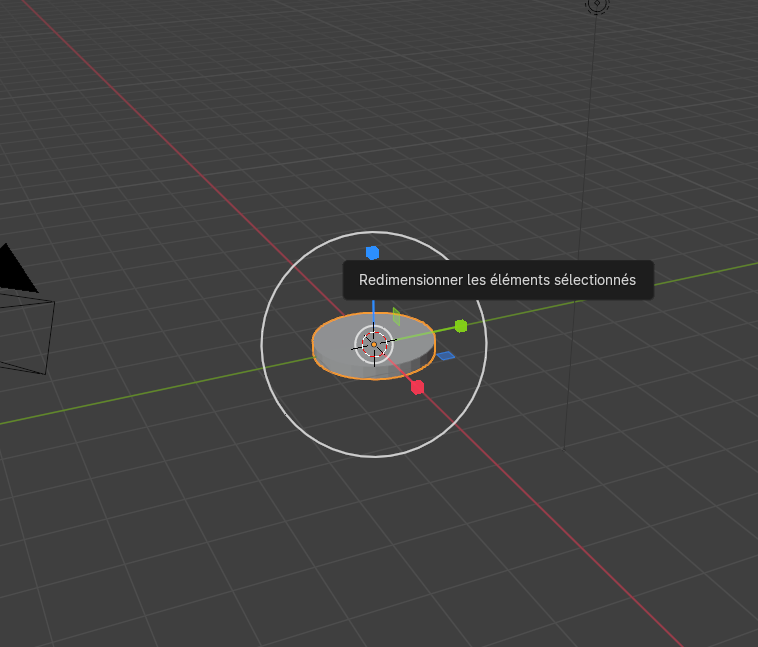

## Integration d'un objet 3D dans un panorama 360° :

Voici le résultat que nous obtenons sur la page web après l'avoir intégré avec le code suivant:

````
<a-entity id="disque" obj-model="obj: ./resources/disque.obj" position="18.89986 -3 15.47396" rotation=""
    material="color:#00ff11">
</a-entity>
````

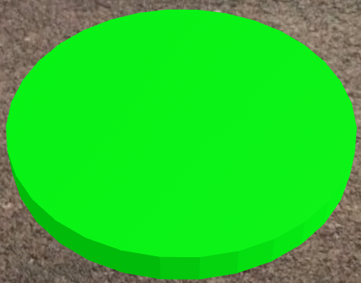


Pour accomplir cela, nous allons utiliser un composant appelé "animation" auquel nous indiquerons le type d'animation requis.


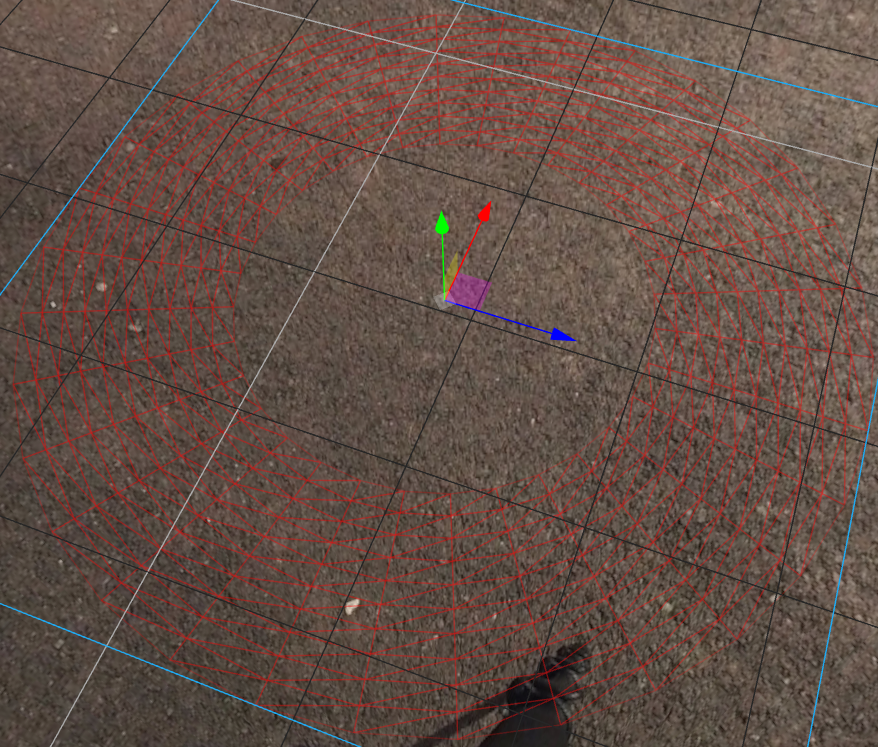


Nous allons également insérer du texte pour mieux orienter l'utilisateur dans son parcours. Pour ce faire, nous ajoutons un composant de texte qui sera associé à une frise positionnée au niveau du sol, afin que le texte soit toujours orienté vers l'utilisateur. Cette fonctionnalité repose sur un morceau de code en JavaScript.


````html
<!-- implémentaion d'une frise sur le panorama pour faciliter le positionnement du texte -->
<a-ring id="navigation" position="0 -1.5 0" wireframe="true" opacity="0.25" color="red" radius-inner="1" radius-outer="2" 
    rotation="-90 0 0">
</a-ring>
````


````js
// crée un composant du nom  de "tang"
AFRAME.registerComponent('tang', {
  // On enregistre les paramètres du composant
    schema: {
      // Ce sont les paramètres nommés avec un type et une valeur avant
      angle: {type: 'int', default: 0},
      Y: {type: 'int', default: 1}
    },
      // "int" est la fonction exécutée quand le composant est attaché à un objet  
    init: async function() {
      this.update = this.update.bind(this)
    },
````


ainsi que ce code également:

````html
<!-- Composant qui permet d'afficher le texte que l'on nomme "tang" et qui fonctionne avec l'index.js -->
<a-entity id="Batiment1" text="value: Batiment 1; align: center; width: 20; color: #ffea00" 
    position="6.01464 2.92799 -5.90422" visible="" rotation="10.3606 -34.11021 0.21715100435458204">
</a-entity>

<a-entity id="piste_d'athetisme" text="value: Bruleur de calories; align: center; width: 20; color: #FFFFFF" 
    position="-21.059 -1.48178 -2.36598" rotation="-2.8361410858975753 127.2734068635903 3.6096341093241864">
</a-entity>

<a-plane id="penneau_statue" tang="angle: 123; Y: -1" color="#CCC" height="20" width="20" 
    material="color: #231f1f; blending: none; side: double" scale="-0.3 0.14 0.00001" 
    position="-4.357112280120217 -2.5 6.709364543563392" rotation="-7.125016348901799 147.00000000000003 -8.013266132661394e-16">
</a-plane>
    
<a-entity id="Definition" text="value: Une oeuvre majeure du debut de ce XXeme siecle d`un sculpteur iconnu qui evoque la force, la reflexion et l`espoir. Cette sculpture 
    capture l`instant de la projection vers le resultat. 
    Elle est exposee devant les pistes d'athletisme pour inspirer tous les sportifs qui la contemplent. 
    Il est possible que la feuille de vigne, ce voile de pudeur qui cache legerement quelque chose de genant sans le faire pleinement  disparaître veritablement est ete rajoute en post-production.
    ; align: center; width: 8.5; color: #ffffff" position="-3.40574 -1.93257 5.28767" 
    rotation="-7.125016348901799 147.00000000000003 -8.013266132661394e-16" visible="" scale="0.5 0.5 0.5">
</a-entity>

<a-entity id="Statue" text="value: STATUE; align: center; width: 20; color: #FFFFFF" 
    position="-2.82675 0.76727 6.70936" rotation="7.0766017276607975 155.15296021686103 82.74083519484218" 
    animation__1="property: scale; to: 0.95 0.95 0.95; dir: alternate; loop: NaN" visible="">
</a-entity>
````
Avec ce code, nous allons utiliser une classe personnalisée appelée "tang", qui nous permettra d'être perpendiculaires par rapport à la position de la caméra, assurant ainsi un positionnement optimal du texte.

Ensuite, nous créons des animations : une animation modifiera la couleur du texte du blanc au bleu, tandis que l'autre animation fera varier la taille du texte en l'agrandissant puis en le réduisant.

Nous allons également consulter le site d'A-Frame pour obtenir des informations supplémentaires sur https://aframe.io/docs/1.5.0/components/text.html, qui nous donne des instructions complémentaires pour écrire du texte avec A-Frame.

Ensuite, nous pouvons modifier certains paramètres dans le mode inspecteur qui nous permettront de personnaliser le texte, comme sa couleur, son alignement...


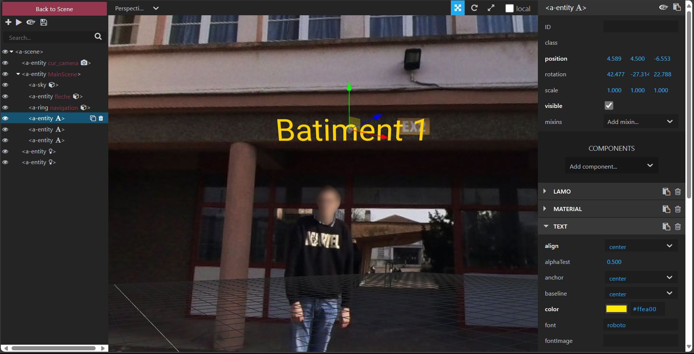


Sur la gauche, nous sélectionnons le texte, puis nous choisissons le menu "Text" à droite, qui nous permettra de modifier différentes options pour personnaliser le texte selon nos préférences. Une fois les modifications effectuées, nous pouvons ensuite copier le code de la même manière que précédemment.


# [Partie 4 - Implémentation d'une vidéo](https://maximer37.github.io/VR-Markdown/guide1/partie4/index.html)


Pour débuter la lecture d'un fichier vidéo ou audio, une interaction est nécessaire pour les démarrer : ceux-ci sont bloqués par défaut. Ceci est dû à des préoccupations concernant notamment l'économie de bande passante. Dans notre situation, nous allons concevoir une nouvelle page HTML comportant un panneau avec l'inscription "click me" dessus. Ce panneau nous permettra d'interagir avec le site, déclenchant ainsi la lecture automatique de la vidéo. Nous utiliserons une seule ligne de code HTML pour créer ce panneau.

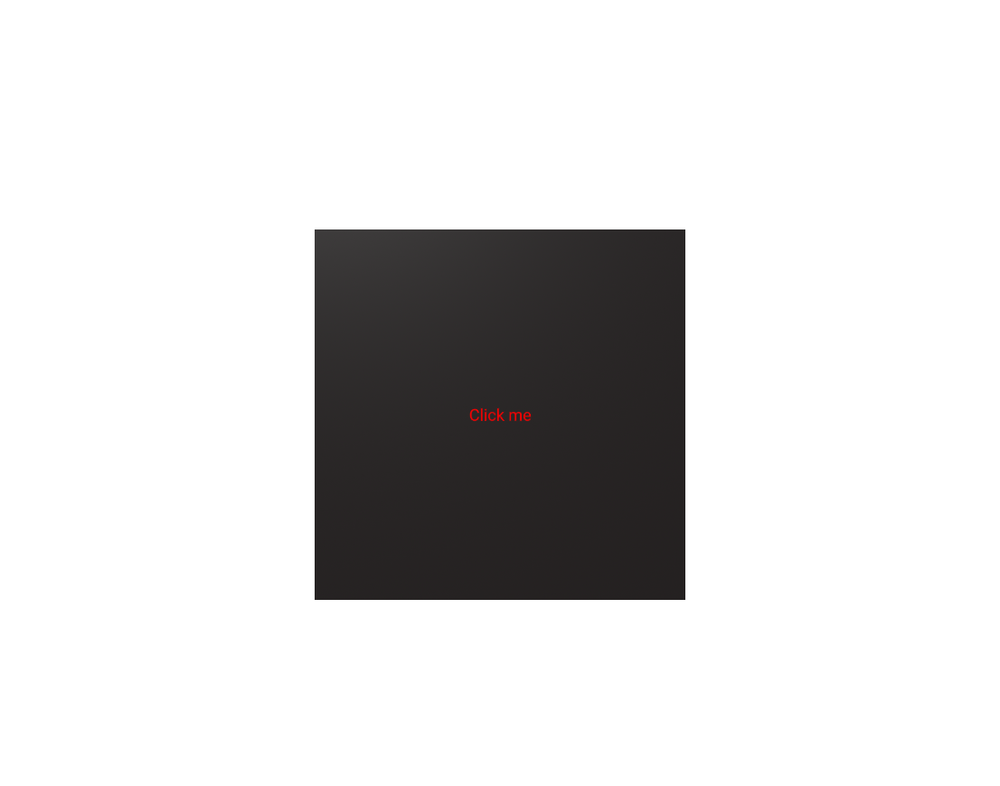

````html
<a-plane color="#CCC" height="20" width="20" scene-changer="home" material="color:#231f1f; blending: additive" class="raycastable" hide scale="0.064 0.064 0.1" position="0 0 -2.00944" text="align: center; 
alphaTest: 1; color: #ff0000; value: Click me ">
</a-plane>
````


Nous allons également incorporer une vidéo en utilisant cette commande.


````html
<!-- composant pour implementer une video -->
<a-video id="video" autoplayloop="true" src="./resources/video/Pirate.mp4" position="-11.98573 16.27849 9.43671" rotation="-1.2564964447218954 141.74632076859487 -0.038388172273765155" scale="15 15 15">
</a-video>
````

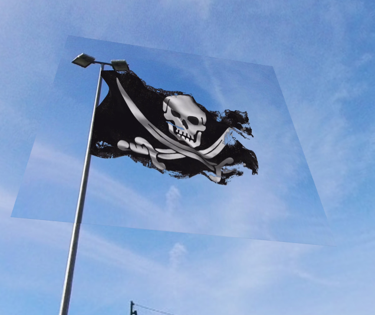

L'intégration de la vidéo dans un panorama à 360° peut être complexe, mais cette tâche devient plus simple lorsqu'elle est intégrée dans un objet en 3D. Par exemple, dans cette incrustation vidéo, des modifications ont été apportées pour l'adapter à son emplacement spécifique.

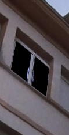