# L'utilisation et configuration du casque Meta quest 2 dans un cadre scolaire 

## Presentation de la plateforme + logiciel 

### Utilisation : 

Voici les logiciels installés sur l'ordinateur fixe qui sont nécessaires pour utiliser le casque VR.

e-space DEC: applications de réalité virtuelle développées pour la formation professionnelle et l'Éducation nationale. Nous proposons avec nos applications un ensemble de plateformes matérielles allant du casque de réalité virtuelle jusqu'au Cube immersif pour vous permettre de vivre dans les meilleurs conditions cette nouvelle expérience immersive.

Meta Quest Developer Hub : est une application qui va permettre de lancer une ***mise en miroir*** à l'aide d'un ***câble 3.0***, permettant aux développeurs de visualiser en temps réel l'interface utilisateur et le contenu de leur application directement sur leur ordinateur, facilitant ainsi le processus de développement et de débogage.

Oculus: qui va permettre d'activer le mode ***Quest Link*** pour utiliser le casque en mode ***PCVR***, offrant ainsi aux utilisateurs la possibilité de connecter leur casque Oculus Quest à un PC via un câble USB 3.0 et de profiter d'une expérience de réalité virtuelle haute performance avec une gamme étendue de jeux et d'applications disponibles sur PC.

SideQuest est une application qui permet de manipuler les données du casque Oculus Quest, offrant aux utilisateurs la possibilité de télécharger, de gérer et de partager du contenu non officiel, ainsi que d'accéder à un store alternatif comprenant une large sélection de jeux, d'applications et de fonctionnalités supplémentaires pour leur casque de réalité virtuelle.

Firefox: Le but principal de Firefox est de fournir un navigateur web sécurisé, rapide et personnalisable aux utilisateurs. Il vise à offrir une expérience de navigation fluide en mettant l'accent sur la protection de la vie privée et la compatibilité avec les normes web modernes. Firefox s'efforce également d'innover en introduisant de nouvelles fonctionnalités et en encourageant la participation communautaire à son développement.

### Creation:

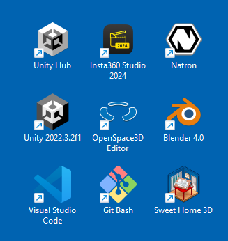

Voici les logiciels qui permettent de créer des environnements de réalité virtuelle. 

Sweet home 3D : Le logiciel Sweet Home 3D est un outil de conception d'intérieur intuitif qui permet aux utilisateurs de créer des plans d'aménagement de maison en 3D. Son objectif principal est de permettre aux utilisateurs de visualiser et de planifier l'agencement des pièces, du mobilier et des éléments décoratifs dans un environnement virtuel avant de les mettre en œuvre dans la réalité.

Visual Studio Code : Visual Studio Code est un éditeur de code source gratuit et open-source développé par Microsoft. Son objectif principal est de fournir un environnement de développement léger et hautement personnalisable pour les développeurs de logiciels. Il offre des fonctionnalités avancées telles que la coloration syntaxique, l'autocomplétion, le débogage intégré, la gestion des versions et l'intégration avec une multitude d'extensions pour répondre aux besoins spécifiques des développeurs.

Blender : Blender est un logiciel de modélisation 3D, d'animation et de rendu, open-source et gratuit. Son objectif principal est de permettre aux utilisateurs de créer des modèles 3D, des animations, des effets visuels, des jeux vidéo et bien plus encore. Avec une gamme complète d'outils de modélisation, de texturage, d'animation et de rendu, Blender offre une solution puissante et polyvalente pour les artistes et les créateurs dans divers domaines tels que l'animation, le design, la visualisation architecturale, et plus encore.

Open Space 3D : OpenSpace 3D est un logiciel open-source conçu pour la visualisation interactive de données géospatiales en 3D. Son objectif principal est de permettre aux utilisateurs de naviguer, d'explorer et d'interagir avec des données géographiques complexes, telles que des modèles de terrain, des cartes topographiques et des images satellitaires, dans un environnement tridimensionnel. Il est utilisé dans divers domaines, notamment la géologie, la géographie, l'archéologie et l'urbanisme, pour faciliter la compréhension et l'analyse des données spatiales.

Unity : Unity est un moteur de développement de jeux vidéo et de contenu interactif utilisé par les développeurs pour créer des expériences immersives en 2D et 3D. Son objectif principal est de fournir un environnement de développement puissant et convivial, avec des outils pour la création de graphismes, la programmation, la physique, l'audio et bien plus encore. Unity est largement utilisé dans l'industrie du jeu, mais aussi dans d'autres domaines tels que la simulation, la formation, la visualisation architecturale et la réalité virtuelle.

insta 360° studio : Le logiciel Insta360 Studio est un outil de post-production conçu spécifiquement pour les vidéos et les images capturées avec les caméras Insta360. Son objectif principal est de permettre aux utilisateurs de traiter, d'éditer et de partager facilement leurs contenus à 360 degrés. Il offre des fonctionnalités telles que la stabilisation, le recadrage, la correction des couleurs, l'ajout d'effets spéciaux et la conversion de formats, afin d'améliorer la qualité et l'impact visuel des médias à 360 degrés.

Natron : Natron est un logiciel de compositing et de traitement d'images open-source, conçu pour les professionnels de l'industrie cinématographique et de l'animation. Son objectif principal est de permettre aux utilisateurs de créer des effets visuels sophistiqués, d'appliquer des corrections colorimétriques et de composer des images numériques en combinant plusieurs sources et en les manipulant de manière précise. Avec ses fonctionnalités avancées et sa compatibilité avec les standards de l'industrie, Natron offre un outil puissant pour la post-production et la création d'effets spéciaux.

### ***AVERTISEMENT***: 

Il est important de prendre conscience des dangers potentiels liés à l'utilisation de la réalité virtuelle (VR) afin de garantir une expérience sûre et agréable. Voici quelques points à considérer :

Épilepsie : Certaines personnes peuvent être sensibles aux stimulations visuelles intenses et rapides, ce qui peut déclencher des crises d'épilepsie. Il est essentiel de faire preuve de prudence en utilisant la VR, en particulier si vous avez des antécédents d'épilepsie ou si vous ressentez des symptômes tels que des étourdissements ou des nausées pendant l'utilisation.

Distances de sécurité : Assurez-vous de disposer d'un espace dégagé autour de vous lorsque vous utilisez la VR pour éviter de heurter des objets ou des personnes. Respectez les distances de sécurité recommandées par le fabricant du casque pour éviter tout accident ou dommage.

Taille de la zone de jeu recommandée : Pour une expérience optimale, utilisez la VR dans une zone de jeu suffisamment grande pour permettre une liberté de mouvement sans risque de collision. Assurez-vous que la zone est dégagée de tout obstacle potentiel et qu'elle offre un espace sûr pour bouger.

Fragilité du matériel : Les équipements de réalité virtuelle sont souvent délicats et peuvent être endommagés facilement en cas de chute ou de choc. Manipulez-les avec précaution et suivez les instructions du fabricant pour leur entretien et leur stockage appropriés.

Ne pas utiliser de lunettes dans le casque : Évitez de porter des lunettes à l'intérieur du casque de réalité virtuelle, car cela peut causer un inconfort et compromettre l'expérience immersive. Si vous portez des lunettes de correction, assurez-vous que le casque est compatible avec leur port ou envisagez d'utiliser des lentilles de contact.

Éviter l'exposition à la lumière du jour et aux produits chimiques : Protégez votre casque VR en évitant de l'exposer directement à la lumière du soleil ou à des sources de chaleur excessive. De plus, gardez-le à l'abri des produits chimiques ou des liquides qui pourraient endommager ses composants électroniques.

La confidentialité des informations est cruciale lors de l'utilisation de la réalité virtuelle, car des mots de passe et d'autres données sensibles peuvent être présents dans la documentation technique. Il est essentiel que les enseignants surveillent attentivement les élèves pendant les sessions pour éviter tout accès non autorisé à ces informations sensibles.

En prenant ces précautions et en étant conscient des risques potentiels, vous pouvez profiter pleinement de votre expérience de réalité virtuelle en toute sécurité. N'oubliez pas de consulter les instructions d'utilisation fournies avec votre équipement et de rester vigilant lors de chaque session de VR.

## Utilisation de la VR en outils de pédagogique - SpeedRun en Melec

### Connecter le casque sur l'ordinateur 

Premier etape allumer l'ordinateur en appuyant sur le bouton alimentation en haut a droite du clavier: 

seconde etape est de deverouilller la session avec le code suivant: 8520. (c'est le meme code pour les casque).

Maintenant on va relier le pc au casque de realité virtuel pour sela on prend le bout du cable USB type C que l'on racorde a l'emplacement sur le coté droit du casque.

on peut allumer le casque avec le bouton de gauche.

on va maintenant appliquer la procedure de meta pour definir une zone de jeu. pour cela une personne doit mettre le casque sur ca tete pour commencer la  procedure:(image issue du casque)

en premiere on va redefinir la zone: 

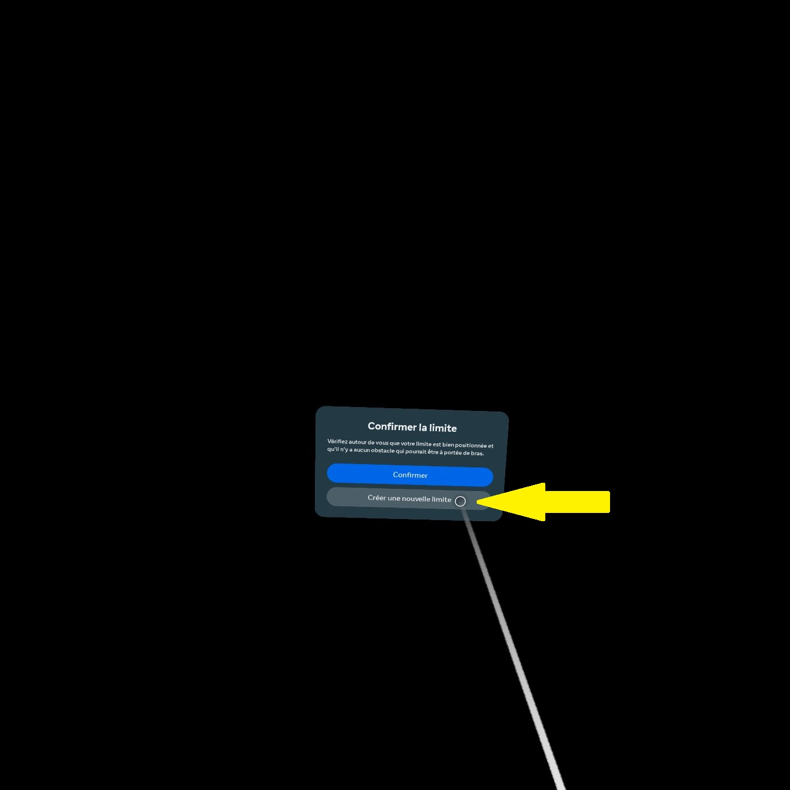

puis on va definir le sol:

Pour ce faire, il vous suffit de toucher le sol avec l'une des deux manettes une fois que la hauteur du sol a été définie, ce qui vous permettra de poursuivre.

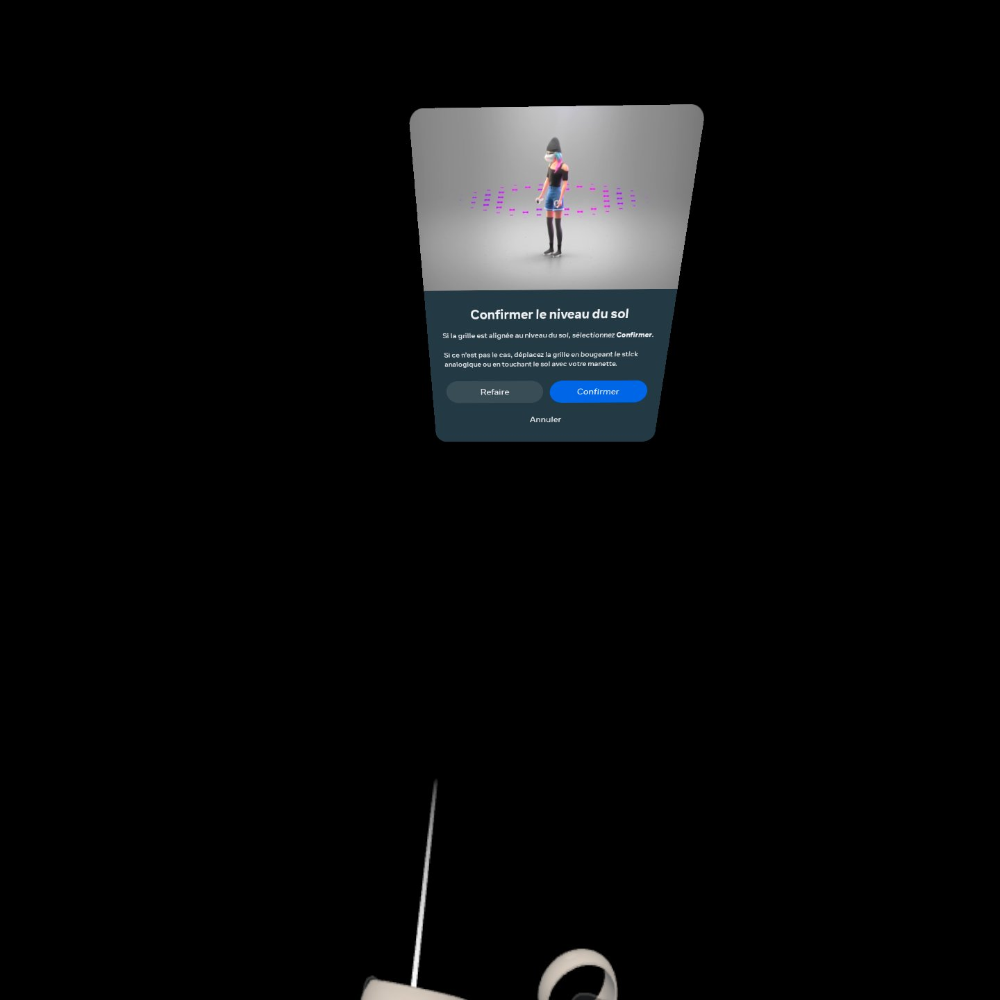

selectionne stationnaire 

puis  maintenant on peut comfirmer

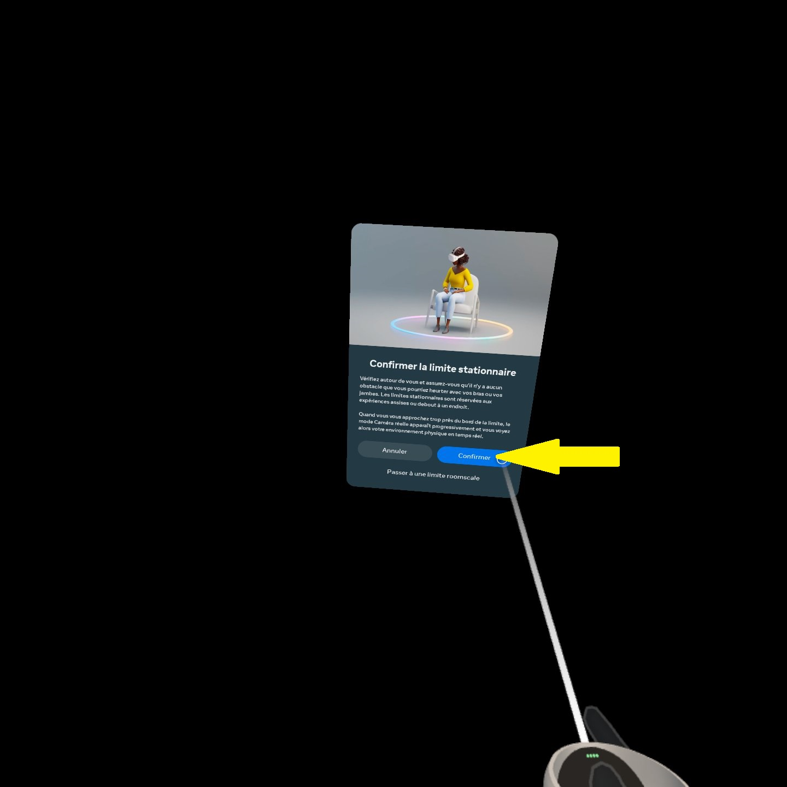

Le casque vous redirigera automatiquement sur le pc

Une fenetre va apparaitre sur l'ecran il faut la reduire la fenetre oculus, pour cela on clique sur la barre

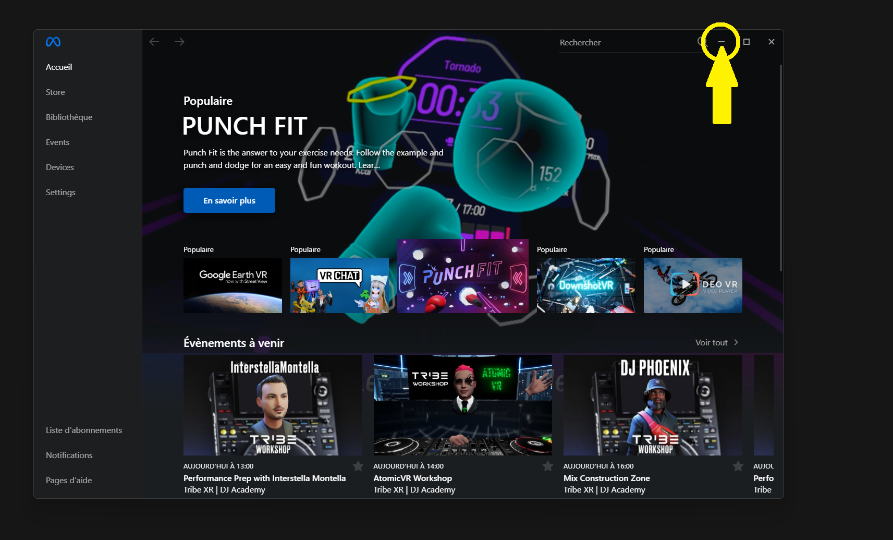

on va  maintenant parametrer l'application DEC pour que le casque se connecte, pour cela en haut a droite on selectionne clasique et un menu deroulant va apparaitre et on peut selectionner Rift / Oculus Link 

maintenant on peut lancer l'application ***Habilitation électrique*** 

Il est probable que le message si desous aparaisse, il signifie qui va  vous rediriger ver l'application 

Une fois charger un menu va apparaitre pour demande de changer d'utilisateur 

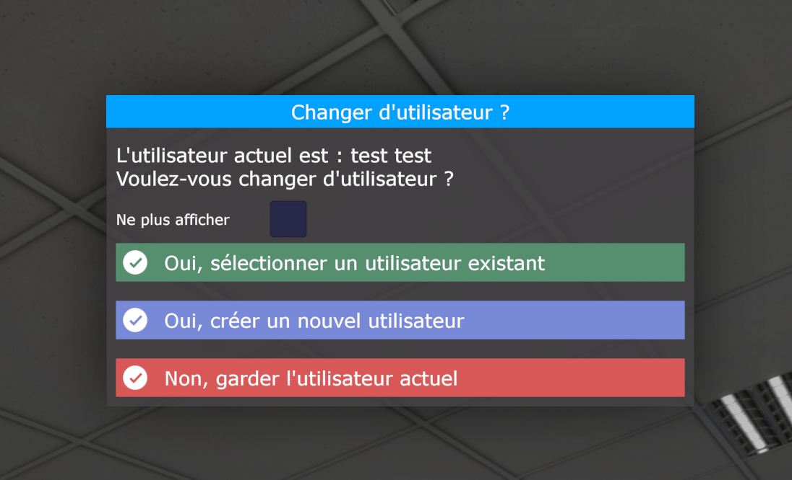

C'est bon vous pouvez maintentant selectionner les differente activité que vous propose l'application avec les manettte du casque

### Créeation d'un utilisateur: 

tout d'abord on selection en haut a gauche dans ***Application*** puis dans la section ***utilisateur*** on selectionne ***nouveau***

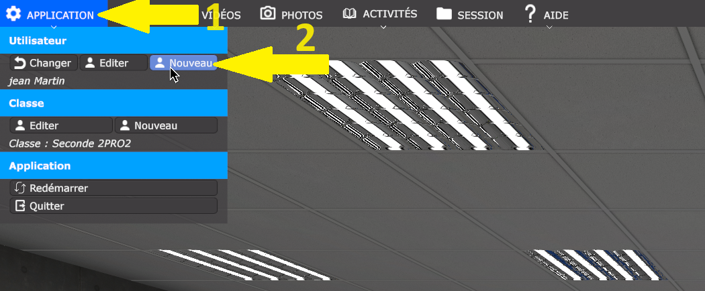

ensuite on peut rentre les coordonnées de l'eleve 

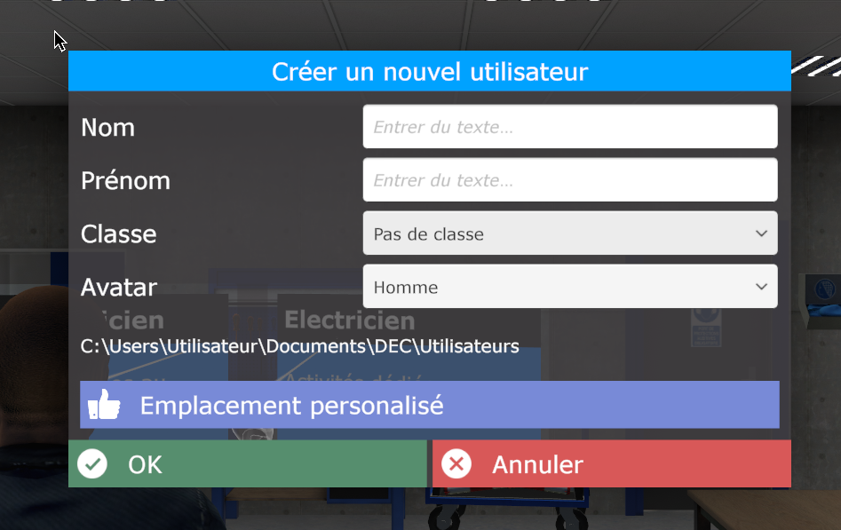

une fois comfirmer un message va apparaitre en bas a droite

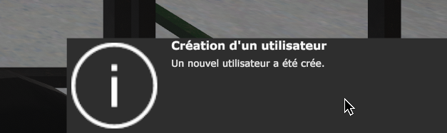

c'est bon l'eleve est crée et peux etre selectionner 

### Créeation d'une classe: 

tout d'abord on selection en haut a gauche dans ***Application*** puis dans la section ***Classe*** on selectionne ***nouveau***

ensuite on peut rentre un nom pour la classe 

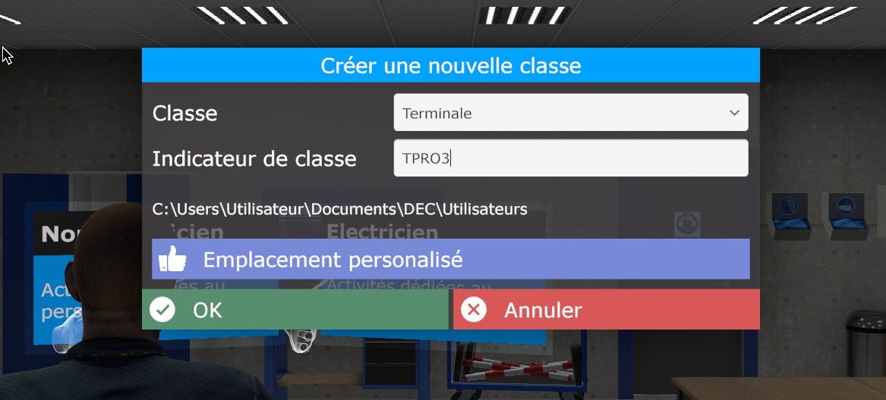

une fois comfirmer un message va apparaitre en bas a droite

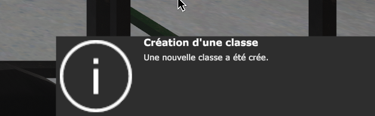

c'est bon la classe est crée et peux etre selectionner 

### Utilisation d'un coompte enseignant 

Vous trouverai des information relative a l'utilisation de l'interface  et du mode enseigant sur le site suivant: [Parametre d'activités généraux](https://vr.docs.decgroupe.com/applications/apprvhabi-userguide/common/activity_settings.html)

## Mise en place du mode mise en mirroir

### Avec le pc et le casque relier a un ordinateur

premiere etape sur le bureau virtuel de l'ordinateur en haut a droite on va selectionner ***Meta Quest Developer Hub*** 

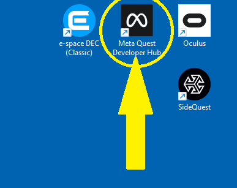

une fois lancer l'application lancer on peut selectionner dans le menu a gauche ***Device Management***

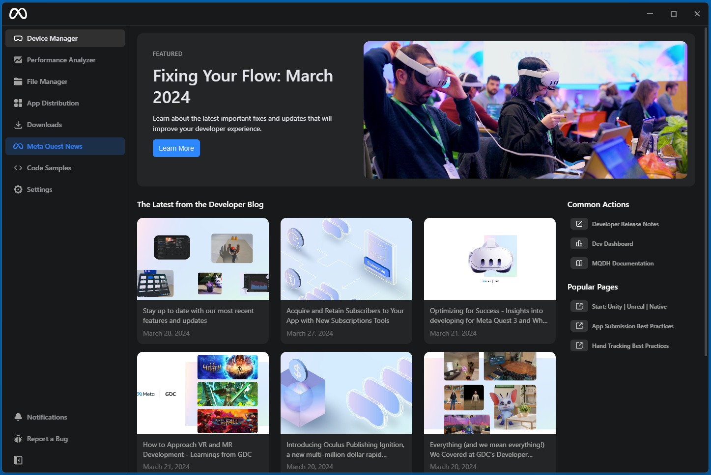

apres selectionner ***Beta Cast*** 

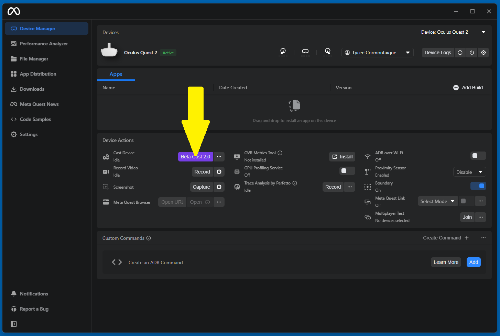