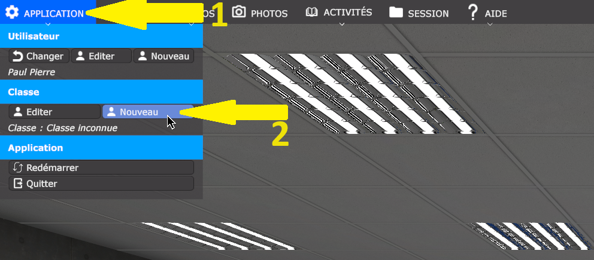

|Les *petits tutoriels de Maxime* |
|------|
|Date: **Avril 2024** |
|Version: **1** |
|Auteur: **Maxime Renauld** |
|Validation/Direction: **Matthieu Farcot** |
|Document réalisé dans le cadre d'un stage de Terminale Professionnelle Bac PRO Systèmes Numériques, option RISC |

# Utilisation et configuration du casque Meta quest 2 dans un cadre scolaire 

## Presentation de la plateforme et des logiciels 

Nous présenterons dans cette section les logiciels *d'utilisation* et les logiciels de *création*

### Logiciels d'utilisation : 

Voici les logiciels installés sur l'ordinateur fixe qui sont nécessaires pour utiliser le casque VR.

**e-space DEC**: une application de réalité virtuelle développées pour la formation professionnelle et l'Éducation nationale. Nous proposons avec nos applications un ensemble de plateformes matérielles allant du casque de réalité virtuelle jusqu'au Cube immersif pour vous permettre de vivre dans les meilleurs conditions cette nouvelle expérience immersive.

**Meta Quest Developer Hub** : une application qui va permettre de lancer une ***mise en miroir*** à l'aide d'un ***câble 3.0***, permettant aux développeurs de visualiser en temps réel l'interface utilisateur et le contenu de leur application directement sur leur ordinateur, facilitant ainsi le processus de développement et de débogage.

**Oculus**: une application qui va permettre d'activer le mode ***Quest Link*** pour utiliser le casque en mode ***PCVR***, offrant ainsi aux utilisateurs la possibilité de connecter leur casque Oculus Quest à un PC via un câble USB 3.0 et de profiter d'une expérience de réalité virtuelle haute performance avec une gamme étendue de jeux et d'applications disponibles sur PC.

**SideQuest** : une application qui permet de manipuler les données du casque Oculus Quest, offrant aux utilisateurs la possibilité de télécharger, de gérer et de partager du contenu non officiel, ainsi que d'accéder à un store alternatif comprenant une large sélection de jeux, d'applications et de fonctionnalités supplémentaires pour leur casque de réalité virtuelle.

**Firefox** : un navigateur web sécurisé, rapide et personnalisable aux utilisateurs.

### Création:

Voici les logiciels qui permettent de créer des environnements de réalité virtuelle. 

**Sweet home 3D** : un outil de conception d'intérieur intuitif qui permet aux utilisateurs de créer des plans d'aménagement de maison et scènes en 3D. Son objectif principal est de permettre aux utilisateurs de visualiser et de planifier l'agencement des pièces, du mobilier et des éléments décoratifs dans un environnement virtuel avant de les mettre en œuvre dans la réalité.

**Visual Studio Code** : un éditeur de code source gratuit et open-source développé par Microsoft. Son objectif principal est de fournir un environnement de développement léger et hautement personnalisable pour les développeurs de logiciels.

**Blender** : un logiciel de modélisation 3D, d'animation et de rendu, open-source et gratuit.

**Open Space 3D** : un logiciel open-source conçu pour la visualisation interactive de données géospatiales en 3D.

**Unity** : un moteur de développement de contenu interactif utilisé par les développeurs pour créer des expériences immersives en 2D et 3D. Son objectif principal est de fournir un environnement de développement puissant et convivial, avec des outils pour la création de graphismes, la programmation, la physique, l'audio et bien plus encore. Unity est largement utilisé dans l'industrie du jeu, mais aussi dans d'autres domaines tels que la simulation, la formation, la visualisation architecturale et la réalité virtuelle.

**insta 360° studio** : un outil de post-production conçu spécifiquement pour les vidéos et les images capturées avec les caméras Insta360.

**Natron** : Natron est un logiciel de compositing et de traitement d'images open-source.

### ***AVERTISEMENT***: 

Il est important de prendre conscience des dangers potentiels liés à l'utilisation de la réalité virtuelle (VR) afin de garantir une expérience sûre et agréable. Voici quelques points à considérer :

**Épilepsie** : Certaines personnes peuvent être sensibles aux stimulations visuelles intenses et rapides, ce qui peut déclencher des crises d'épilepsie. Il est essentiel de faire preuve de prudence en utilisant la VR, en particulier si vous avez des antécédents d'épilepsie ou si vous ressentez des symptômes tels que des étourdissements ou des nausées pendant l'utilisation.

**Distances de sécurité** : Assurez-vous de disposer d'un espace dégagé autour de vous lorsque vous utilisez la VR pour éviter de heurter des objets ou des personnes. Respectez les distances de sécurité recommandées par le fabricant du casque pour éviter tout accident ou dommage.

**Taille de la zone de jeu recommandée** : Pour une expérience optimale, utilisez la VR dans une zone de jeu suffisamment grande pour permettre une liberté de mouvement sans risque de collision. Assurez-vous que la zone est dégagée de tout obstacle potentiel et qu'elle offre un espace sûr pour bouger.

**Fragilité du matériel** : Les équipements de réalité virtuelle sont souvent délicats et peuvent être endommagés facilement en cas de chute ou de choc. Manipulez-les avec précaution et suivez les instructions du fabricant pour leur entretien et leur stockage appropriés.

**Lunettes dans le casque** : Évitez de porter des lunettes à l'intérieur du casque de réalité virtuelle, car cela peut causer un inconfort et compromettre l'expérience immersive. Si vous portez des lunettes de correction, assurez-vous que le casque est compatible avec leur port ou envisagez d'utiliser des lentilles de contact.

**Exposition à la lumière du jour et aux produits chimiques** : Protégez votre casque VR en évitant de l'exposer directement à la lumière du soleil ou à des sources de chaleur excessive. De plus, gardez-le à l'abri des produits chimiques ou des liquides qui pourraient endommager ses composants électroniques.

La confidentialité des informations est cruciale lors de l'utilisation de la réalité virtuelle, car des mots de passe et d'autres données sensibles peuvent être présents dans la documentation technique. Il est essentiel que les enseignants surveillent attentivement les élèves pendant les sessions pour éviter tout accès non autorisé à ces informations sensibles.

En prenant ces précautions et en étant conscient des risques potentiels, vous pouvez profiter pleinement de votre expérience de réalité virtuelle en toute sécurité. N'oubliez pas de rester vigilant lors de chaque session de VR.

## Utilisation de la VR en outils de pédagogique

### Connectez le casque à l'ordinateur

Pour commencer, allumez l'ordinateur en appuyant sur le bouton d'alimentation situé en haut à droite du clavier.

La deuxième étape consiste à déverrouiller la session avec le code suivant : 8520. Ce code est le même pour tous les casques.

Maintenant, nous allons connecter le PC au casque de réalité virtuelle. Pour ce faire, prenez l'extrémité du câble USB de type C et branchez-la dans le port situé sur le côté droit du casque.

Vous pouvez activer le casque en utilisant le bouton situé sur le côté gauche.

Maintenant, nous allons suivre la procédure de Meta pour définir une zone de jeu. Pour cela, une personne doit mettre le casque sur sa tête pour démarrer la procédure. (Image tirée du casque)

Tout d'abord, nous allons redéfinir la zone.

Ensuite, définissez le niveau sol en touchant le sol avec l'une des deux manettes. Une fois que le niveau du sol est définie, vous pourrez continuer.

Choisissez l'option "Stationnaire".

Ensuite, vous pouvez confirmer votre choix.

Le casque vous dirigera automatiquement vers l'ordinateur.

Une fenêtre apparaîtra à l'écran. Pour la réduire, il suffit de cliquer sur la barre correspondante.

Maintenant, nous allons configurer l'application DEC pour que le casque se connecte. Pour cela, dans le coin supérieur droit, sélectionnez "Classique", puis un menu déroulant apparaîtra où vous pouvez choisir "Rift / Oculus Link".

Maintenant, vous pouvez démarrer l'application.***Habilitation électrique*** 

Il est possible que vous rencontriez le message ci-dessous, indiquant qu'il vous redirigera vers l'application.

Une fois chargé, un menu apparaîtra pour demander le changement d'utilisateur.

C'est fait ! Vous pouvez maintenant choisir parmi les différentes activités proposées par l'application en utilisant les manettes du casque.

### Création d'un utilisateur

Tout d'abord, commencez par sélectionner ***Application*** en haut à gauche, puis dans la section ***Utilisateur*** , choisissez ***Nouveau***.

Ensuite, vous pouvez saisir les coordonnées de l'élève.

Une fois confirmé, un message s'affichera dans le coin inférieur droit de l'écran.

C'est terminé, l'élève a été créé et peut maintenant être sélectionné.

### Création d'une classe

Tout d'abord, commencez par sélectionner ***Application*** en haut à gauche, puis dans la section ***Classe*** , choisissez ***Nouveau***.

Ensuite, vous pouvez saisir un nom pour la classe.

Une fois confirmé, un message apparaîtra dans le coin inférieur droit.

La classe est maintenant créée et peut être sélectionnée.

### Utilisation d'un compte destiné aux enseignants

Vous trouverai des information relative a l'utilisation de l'interface  et du mode enseigant sur le site suivant: [Parametre d'activités généraux](https://vr.docs.decgroupe.com/applications/apprvhabi-userguide/common/activity_settings.html)

## Configuration du mode de mise en miroir
### La mise en miroir avec le casque connecté à un ordinateur

***Matériel nécéssaire:***

Un ordinateur répondant aux spécifications requises: [specification](https://www.meta.com/fr-fr/help/quest/articles/headsets-and-accessories/oculus-link/requirements-quest-link/)

Un câble USB de type-C vers USB de type-A en version 3.0.

Un casque Meta Quest 2.

***Procédure***

La première étape consiste à sélectionner ***Meta Quest Developer Hub*** dans le coin supérieur droit du bureau virtuel de l'ordinateur.
 

Une fois que l'application est lancée, vous pouvez accéder au menu de gauche et sélectionner ***Device Management***.

Ensuite, choisissez ***Beta Cast***.

### Mise en miroir avec une connexion WI-FI 

Pour configurer le mode miroir sur votre Meta Quest 2 avec un ordinateur, un Chromecast ou un téléphone, veuillez suivre la procédure détaillée sur le site officiel de Meta: [Mise en miroir](https://www.meta.com/fr-fr/help/quest/articles/in-vr-experiences/oculus-features/cast-with-quest/)
